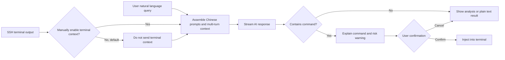

<div align="center">

# PuTTY AI

### Let your SSH terminal understand natural language

An AI-enhanced SSH client based on [PuTTY](https://www.chiark.greenend.org.uk/~sgtatham/putty/),  
consolidating terminal context, fault analysis, command generation, and execution confirmation into a single window.


</div>

> [!IMPORTANT]
> `v1.0.6` sets the initial window size directly based on the current monitor's work area (68% width, 62% height), no longer constrained by the 80×24 terminal grid from saved sessions, providing stable and balanced initial space for both the terminal and the AI sidebar. The Windows client integrates the AI sidebar, optional terminal context, compatible model interfaces, command confirmation, and security controls. AI output may still contain errors; manual review is required before executing any generated commands. It is not currently recommended for unattended production operations.

This project is maintained by an independent developer and is not affiliated with PuTTY, OpenAI, any model provider, or bastion host vendor. It does not represent endorsement, sponsorship, or authorization from these projects or organizations. Third-party names are used solely to indicate compatibility and license attribution; all relevant rights belong to their respective owners.

## Project Overview

Developers, sysadmins, and support engineers frequently switch between SSH terminals, search engines, and AI tools: copying error logs, supplementing context, generating commands, and pasting them back into the terminal. This workflow not only reduces efficiency but also risks missing critical information or executing commands incorrectly.

PuTTY AI preserves PuTTY's native usage habits while adding an AI assistant that can optionally perceive the current session's context. Users can describe issues directly in natural language, allowing the AI to assist with log analysis, command explanation, fault isolation, and operational recommendations.

## Implemented Features

- **Optional terminal context**: Terminal context is not sent by default; users can optionally attach sanitized current SSH session content as needed.
- **Natural language interaction**: Directly ask about error causes, system status, troubleshooting approaches, or Linux command usage.
- **Fault and log analysis**: Summarizes anomalies based on terminal output and provides verifiable troubleshooting steps.
- **Streaming response**: Chat Completions requests enable streaming; the right-side session area updates immediately upon receiving content chunks.
- **Stable streaming reading**: Scrolls lock the reading position when scrolling up; streaming appends and completed Markdown reflows do not hijack the scrollbar. Auto-scroll resumes when returning to the bottom.
- **Chinese multi-turn sessions**: UI prompts, settings, system prompts, and model request contexts use Chinese, supporting continuous follow-up questions.
- **Multi-host workbench**: Top host tabs display current connections and online status, allowing switching between multiple PuTTY processes; AI chat history is isolated per host.
- **Command generation and explanation**: Generates candidate commands with explanations of their purpose, parameters, and potential impact.
- **Post-confirmation terminal injection**: Commands are displayed first, confirmed, and then sent to the SSH terminal, reducing misoperation risks.
- **Compatible with custom models**: Supports OpenAI Chat Completions-compatible interfaces; endpoint configuration and API Key persist across sessions.

## Interaction Flow



## Use Cases

| Scenario | Example Query |
| --- | --- |
| Troubleshooting | "Why did this service fail to start?" |
| Log Analysis | "Summarize the key anomalies in this log segment." |
| System Inspection | "Find the directory consuming the most disk space." |
| Command Learning | "Explain the role of each parameter in this command." |
| Daily Operations | "Provide safe steps to restart this service." |

Primarily targeted at software developers, sysadmins, QA engineers, support staff, and users learning Linux and SSH.

## Fixes & Optimizations in This Version

- Fixed an issue where chat body text occasionally turned white after one or two rounds and required re-selection to revert to black; the session area now maintains readable black text after redraws.
- Chat Completions requests now enable streaming responses; the first content chunk is displayed immediately upon arrival without waiting for the full response to generate.
- Terminal context is not transmitted by default; right-side prompts and settings are unified in Chinese.
- Window redesigned per UI specifications into a borderless, dual-layer host workbench: a 44px black session bar spanning the full width, a 46px blue host info bar, a 440px cool-gray AI panel, and minimize/maximize/restore/close buttons on the far right of the black global bar.
- Both streaming and complete responses render Markdown; headings, bold, italic, strikethrough, lists, blockquotes, tables, links, inline code, and fenced code blocks are no longer displayed as raw syntax.
- User queries, AI responses, system messages, and error messages use distinct label colors, text colors, and backgrounds; each AI response is clearly labeled "AI Assistant", with fine lines separating turns, allowing quick differentiation in continuous multi-turn conversations.
- Candidate commands no longer use ambiguous fixed buttons; hovering over response code blocks shows **Fill into Terminal**, while dangerous commands show **Inspect & Fill**.
- Multiple PuTTY host connections appear in the top tab bar; switching tabs synchronously switches the terminal and right-side AI session, with chat history isolated per host.
- Top global window controls simultaneously minimize, maximize/restore, or close all running PuTTY AI sessions, while retaining per-session confirmation protection upon close.
- Host info bar displays the configured or actual login user from the SSH `login as:` prompt; if unreliable, the user info item and session tab hide automatically without showing placeholders.
- Bottom action area uses independent toggles for sanitized terminal context and clear conversation; session history is always retained within the current host, removing easily misclicked save options.
- Text and toggle track for sanitized terminal context are compactly arranged; the first-launched main window centers on the current monitor's work area.
- Main window disables DWM non-client area drawing artifacts and uses square corners, self-drawing a continuous four-border frame at the outermost client area; top host bar, left terminal, and right AI panel are fully enclosed by the same outer frame, preventing broken edges after long runs or app switching.
- "You" and "AI Assistant" role titles uniformly use Microsoft YaHei UI font (optimized for CJK/Latin mixing), identical size and weight, while preserving label colors to enhance multi-turn conversation recognition and visual consistency.

## Build from Source

The Windows `putty` target in the repo builds `putty.exe` with a native AI sidebar. The implementation relies only on Windows-native WinHTTP, Rich Edit, and Data Protection API, requiring no browser components.

### Requirements

- Windows 10/11
- CMake 3.7 or higher
- Visual Studio 2022 with the "Desktop development with C++" workload

### Build Steps

```powershell
cmake -S putty-src -B build -G "Visual Studio 17 2022" -A x64
cmake --build build --config Release --target putty
```

After building, the executable is typically located at:

```text
build\Release\putty.exe
```

The repo also provides a build script that automatically locates Visual Studio 2022 Build Tools:

```powershell
scripts\build-windows.cmd
```

## Automated Launch Compatibility & Connection Keep-Alive

- Supports automated launchers connecting via `@sessionname`, `-load sessionname`, `-load tmp:tempconfig`, or `-raw -P localport`. `tmp:` files are read in UTF-8 `key=value` format, supporting PuTTY fields like HostName, PortNumber, UserName, WinTitle, terminal size, and encoding; unknown fields are ignored. If a Raw session only provides a valid local relay port, the program prepends `127.0.0.1` and connects directly without jumping to Configuration.
- Application-layer keep-alive intervals for non-serial sessions are capped at 30 seconds (30s used if unconfigured or too long), alongside Windows TCP keepalive; TCP initial probe is 30s, subsequent intervals are 10s, to prevent bastion hosts, NATs, or firewalls from reclaiming idle connections.
- Keep-alive prevents idle timeouts. If the network physically drops or the remote closes the SSH transport, the original session cannot be losslessly recovered and requires reconnection.

Automated launchers can directly establish SSH sessions in the following format, where the temp config must at least contain `HostName`, `PortNumber`, and `UserName`:

```powershell
putty.exe -load "tmp:C:\path\to\session.conf" -pw "password"
```

PuTTY loads the temp config and password to connect directly, bypassing the Configuration page. Release builds do not log the original launch command line to prevent `-pw`, usernames, hosts, and other sensitive parameters from being written to diagnostic files.

## AI Panel Usage

After establishing an SSH session, the PuTTY AI panel appears on the right:

1. Click **Settings** to fill in the OpenAI Chat Completions-compatible endpoint, model name, and API Key via Chinese setting items; right-side buttons, status, and prompts are all in Chinese.
2. After clicking **Save Permanently**, the endpoint, model, API Key, and context length are saved to the current user's configuration, restored on the next session open, and remain editable. The API Key is encrypted per-user via Windows DPAPI and never written to the registry in plaintext.
3. Terminal context is not sent by default; enable the **Attach sanitized terminal context** toggle below the input area when needed. This option does not affect multi-turn chat history transmission. Terminal context reads up to 12,000 characters by default, configurable between 1,000 and 64,000.
4. Model requests use streaming responses; the first content chunk is displayed immediately and continuously renders Markdown as content grows. Final rendering applies upon completion. Scrolling up preserves the reading position, and auto-scroll resumes when returning to the bottom.
5. Terminal context undergoes best-effort sanitization for passwords, tokens, authorization headers, and private keys before transmission.
6. The current host supports multi-turn sessions; subsequent questions carry previously successful Q&A records. Assembled session context and system prompts use Chinese, requesting the model to reply in Simplified Chinese. The system prompt does not require commands in every response; models can directly return analysis or plain-text conclusions. Chat histories across different hosts are isolated.
7. Markdown headings, bold, italic, strikethrough, lists, blockquotes, tables, links, inline code, and code blocks in responses are converted to native rich text. Hovering over recognized command code blocks shows **Fill into Terminal**; the program only injects the command into the terminal and does not auto-send Enter.
8. User, AI, system, and error messages feature distinct label, text, and background styles; multi-turn chats and session area redraws do not turn body text white.
9. Click back to the left terminal from the right chat area to restore keyboard interaction. High-risk commands like delete, format, stop service, or permission changes require double confirmation.
10. The top black session bar lists currently running PuTTY hosts; clicking tabs switches the corresponding terminal, and the right AI panel switches synchronously. Chat history is automatically retained per host; **Clear Conversation** provides an independent button and requires confirmation before execution.

The right panel uses a fixed 440px width by design; it responsively shrinks on narrow windows, preserving an interactive area for the left terminal.

Default values for the current session can also be provided via environment variables:

```powershell
$env:OPENAI_BASE_URL = "https://example.com/v1"
$env:OPENAI_MODEL = "your-model"
$env:OPENAI_API_KEY = "your-api-key"
```

`OPENAI_BASE_URL` can be the service root or the full `/chat/completions` path. Environment variables act as defaults only when no saved values exist; after clicking **Save Permanently** or initiating a request, current settings are written to the user configuration.

### Audit

- The program logs metadata audit logs by default, excluding queries, responses, context, command bodies, and API Keys, located at `%LOCALAPPDATA%\PuTTY AI\audit.log`. Logs contain only timestamps, event types, model endpoint hosts, and risk levels.

## Testing & Verification

This version has passed the following regression tests:

| # | Regression Scenario | Expected Result |
| --- | --- | --- |
| 1 | Clean IPv4 address text with leading/trailing invisible whitespace | Address content remains correct; parsing does not fail due to CR/LF characters |
| 2 | Edit and permanently save Chat Completions configuration | Configuration persists, is editable, and functions normally after closing and reopening the session |
| 3 | Return to left terminal after right-side chat | Left terminal immediately restores mouse and keyboard interaction |
| 4 | Permanently save API Key | API Key remains functional after closing and reopening the session |
| 5 | Check context and prompts sent to the model | Assembled content uses Chinese; model defaults to Simplified Chinese responses |
| 6 | Request analysis instead of commands | System prompt allows model to return analysis or plain text without forcing command-line output |
| 7 | Conduct continuous multi-turn Q&A | Subsequent requests carry prior successful Q&A records, maintaining session continuity |
| 8 | Check knowledge base features and related prompts | Knowledge base features removed; no remnants in UI or prompts |
| 9 | PuTTY maintains remote connection long-term | No client-initiated idle disconnects; app-layer and TCP keep-alive prevent `Network error: Software caused connection abort` |
| 10 | Automated launcher uses `-load tmp:tempconfig -pw password` to launch PuTTY | Correctly reads HostName, PortNumber, UserName and establishes SSH session directly without showing Configuration page |
| 11 | Model streams Markdown headings, completes with bold lists and code blocks | Heading styles display immediately during streaming; syntax markers are removed upon completion, preserving rich text formatting |
| 12 | Continuously inspect user queries and AI responses | Both sides use distinct label/text/background colors; AI responses clearly label "AI Assistant", turns are separated by fine lines, and text remains readable |
| 13 | Verify window against UI design | No native title bar; 44/46px dual-layer host bar spans full width, window controls are in the global bar, 440px AI panel uses cool-gray background with white content surface |
| 14 | Hover mouse over command code block in AI response | Shows "Fill into Terminal" only near the code block; hides on mouse leave or scroll; dangerous commands show inspection prompt |
| 15 | Launch multiple PuTTY host connections simultaneously and click top tabs | Switches to corresponding PuTTY process, terminal and AI panel switch synchronously, chat histories per host do not leak |
| 16 | Scroll up chat history during streaming output | Appended text and completion reflows do not flicker or hijack scrollbar; auto-scroll resumes upon returning to bottom |
| 17 | Click top-right global window controls | Minimize, maximize/restore, and close buttons are visible and execute corresponding operations for the entire PuTTY window |
| 18 | Check session actions below input area | Terminal context toggle is off by default; session history selection is hidden but multi-turn records are auto-retained; clear conversation uses independent button and requires confirmation |
| 19 | First launch and check context toggle layout | Main window centers near current monitor work area; toggle track is adjacent to text and does not overlap with clear button |
| 20 | Check four outer edges of main window | Top, bottom, left, and right use a continuous 1px outer frame; all left/right content is fully enclosed with no DWM edge artifacts |
| 21 | Check "You" and "AI Assistant" role titles | Both titles use identical Microsoft YaHei UI font, size, and bold weight; label colors still clearly distinguish conversation parties |

Automation & remote verification entry points:

```powershell
# Configuration, public IPv4, connection keep-alive, terminal & line editing regression tests
build\Release\test_conf.exe
build\Release\test_terminal.exe
build\Release\test_lineedit.exe

# Local compatible model + remote terminal end-to-end test
powershell -ExecutionPolicy Bypass -File tests\run-integration.ps1

# Dangerous command double-confirmation test
powershell -ExecutionPolicy Bypass -File tests\run-integration.ps1 -Dangerous

# Public SSH service handshake test (does not use local credentials)
powershell -ExecutionPolicy Bypass -File tests\run-remote-ssh.ps1

# Specify your own or authorized SSH service for testing
powershell -ExecutionPolicy Bypass -File tests\run-remote-ssh.ps1 `
  -HostName ssh.example.com -Port 22
```

Remote verification defaults to connecting `ssh.github.com:443`, with Pageant and connection sharing disabled, only verifying host key negotiation and the server entering the `publickey` authentication phase. Receiving `No supported authentication methods available (server sent: publickey)` without credentials is expected, indicating the SSH connection and handshake successfully reached the authentication stage.

Packaged artifacts are located at `package/PuTTY-AI-v1.0.6-windows-x64.zip`, containing `putty.exe`, app-local VC Runtime, project and PuTTY licenses, third-party notices, and release notes.

## Completed Development Tasks

- [x] Import PuTTY 0.84 source code
- [x] Define product positioning and core interaction flow
- [x] Implement AI interaction panel on the right side of the terminal
- [x] Implement session context extraction and length control
- [x] Integrate OpenAI Chat Completions-compatible interface
- [x] Support Chat Completions streaming responses
- [x] Do not send terminal context by default, support optional sanitized attachment
- [x] Support Chinese prompts and multi-turn sessions
- [x] Localize right-side prompts and settings to Chinese
- [x] Support cross-session persistence for Chat Completions config and API Key
- [x] Support streaming and completed Markdown rich text rendering, code blocks, and command display
- [x] Use distinct visual styles to differentiate user queries, AI responses, system messages, and error messages
- [x] Support command confirmation and one-click injection
- [x] Change command injection to hover action on response code blocks
- [x] Fix session area text color and focus switching issues between left/right areas
- [x] Implement borderless window, dual-layer host bar, and 440px responsive AI panel per UI design
- [x] Use visible context toggle, background auto-session recording, and independent clear button
- [x] Provide global minimize, maximize/restore, and close buttons for borderless window
- [x] Support multi-PuTTY process host tab switching and per-host AI session isolation
- [x] Fix streaming redraw flickering and scrollbar hijacking during upward reading
- [x] Support IPv4 address cleaning, generic temp config launch, and long-connection keep-alive
- [x] Remove knowledge base features and prompt remnants
- [x] Add dangerous command identification and double confirmation
- [x] Add sensitive information sanitization and privacy controls
- [x] Add extended capabilities like metadata operation auditing

## Project Structure

```text
putty-ai/
├── putty-src/              # PuTTY 0.84 and PuTTY AI source code
│   └── windows/ai.c        # AI panel, model calls, security & audit implementation
├── package/                # Windows release package generated after build
└── readme.md               # Project documentation
```

## Security & Privacy

AI-generated commands may be inaccurate or unsuitable for the current environment. Before executing any command, verify the target host, permission scope, and command impact, exercising extreme caution with high-risk operations like file deletion, permission modification, or service termination.

This version provides context scope control, sensitive information sanitization, Windows DPAPI user-level protection for API Keys, and dangerous command confirmation mechanisms. Release builds do not log original launch command lines.即便如此, do not send passwords, private keys, tokens, or other confidential information to untrusted model services.

## Contributing

Welcome to submit use cases, feature suggestions, and feedback via Issues, and to participate in development for the AI panel, model integration, security policies, and documentation.

Before submitting code, please ensure changes have a clear scope and include necessary build or testing instructions.

## Credits & License

This project is based on [PuTTY](https://www.chiark.greenend.org.uk/~sgtatham/putty/) 0.84 source code for exploration and development, and is not an official PuTTY project.

Original incremental code and project materials for PuTTY AI are licensed under the [LICENSE](LICENSE) in the repository root. PuTTY source code in the repo remains under its original license terms; see [putty-src/LICENCE](putty-src/LICENCE) for details. Retaining original copyright and organization names fulfills license attribution requirements only and does not imply affiliation or official association with this project.

---

<div align="center">

If this direction is helpful to you, feel free to Star the project and join the discussion.

</div>
