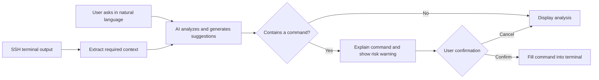

<div align="center">

# PuTTY-Assistant

### An AI assistant beside your SSH terminal

A Windows SSH client based on [PuTTY](https://www.chiark.greenend.org.uk/~sgtatham/putty/) with an on-demand AI assistant. It helps users understand terminal output, explain commands, organize troubleshooting ideas, and review candidate commands before filling them into the terminal.


</div>

> [!IMPORTANT]
> `v1.0.6` sizes the first window directly from the active monitor's working area (68% wide by 62% high), so saved 80x24 terminal grids no longer produce a cramped terminal-and-AI workspace. Treat this release as an on-demand AI assistant: it answers user questions, explains output, and suggests candidate commands, but it does not autonomously plan tasks, operate continuously, or make decisions for the operator. AI output may still be incorrect. Always review generated commands manually before executing them; direct use in unattended production operations is not recommended.

This is an independently maintained project. It is not affiliated with, authorized by, sponsored by, or endorsed by PuTTY, OpenAI, any model provider, or any bastion-client vendor. Third-party names are used only to describe compatibility and license attribution; all related rights belong to their respective owners.

## What This Is

PuTTY-Assistant is an AI assistant beside the SSH terminal. It does not take over the terminal or complete tasks for the user. The user asks a question, optionally provides processed terminal context, the model returns an explanation or suggestion, and the user decides whether to fill or execute anything.

## Explicit Boundaries

- It is not a copilot and does not proactively observe or advance a task.
- It is not an agent; it does not autonomously call tools, run commands continuously, or manage remote hosts.
- It never presses Enter automatically for a generated command. High-risk operations remain user-confirmed.

More autonomous task planning and tool use may be explored later in a separate project named **Terminal-Agent**. Those capabilities are not part of this repository's current scope.

The current maintenance entry point is this repository: [AI-DIY/PuTTY-Assistant](https://github.com/AI-DIY/PuTTY-Assistant).

## How It Works

Developers, operations engineers, and technical support staff often switch repeatedly between an SSH terminal, search engines, and AI tools: copy an error, add context, generate a command, then paste it back into the terminal. This workflow affects efficiency and makes it easy to miss important information or execute the wrong command.

The workflow is deliberately small: ask a question, optionally attach terminal context, read the model's response, and decide what to do. Terminal context is disabled by default, and candidate commands are only filled into the terminal after confirmation.

Typical uses include explaining errors, reading logs, learning commands, organizing troubleshooting steps, and filling a reviewed candidate command into the terminal.

## Features

- **Terminal context awareness**: Read the current SSH session on demand, reducing manual copying and background setup.
- **Natural-language interaction**: Ask directly about error causes, system status, troubleshooting approaches, or Linux command usage.
- **Fault and log analysis**: Summarize anomalies from terminal output and provide troubleshooting steps that can be verified.
- **Command generation and explanation**: Generate candidate commands and explain their purpose, parameters, and potential impact.
- **Fill after confirmation**: Show a command first, ask for confirmation, and then fill it into the SSH terminal. The client does not press Enter automatically.
- **Compatible custom models**: Supports OpenAI Chat Completions-compatible endpoints, streaming responses, and persistent settings.
- **Stable streaming reading**: Scrolling upward locks the current reading position so incremental Markdown rendering cannot pull the scrollbar back to the end.
- **Multi-host workspace**: The top host tabs switch between running PuTTY processes, while each host keeps an isolated AI conversation.

## Interaction Flow



## Use Cases

| Scenario | Example question |
| --- | --- |
| Troubleshooting | "Why did this service fail to start?" |
| Log analysis | "Summarize the key anomalies in this log." |
| System checks | "Find the directories using the most disk space." |
| Command learning | "Explain what each parameter in this command does." |
| Daily operations | "Give me the steps to restart this service safely." |

The project is primarily intended for development engineers, operations engineers, testers, technical support staff, and people learning Linux and SSH.

## Building from Source

The Windows `putty` target in this repository produces `putty.exe` with a native AI sidebar. The implementation uses Windows-provided WinHTTP, Rich Edit, and data-protection APIs and does not require browser components.

### Requirements

- Windows 10/11
- CMake 3.7 or later
- Visual Studio 2022 with the "Desktop development with C++" workload installed

### Build

```powershell
cmake -S putty-src -B build -G "Visual Studio 17 2022" -A x64
cmake --build build --config Release --target putty
```

After the build completes, the executable is usually located at:

```text
build\Release\putty.exe
```

The repository also provides a build script that automatically locates Visual Studio 2022 Build Tools:

```powershell
scripts\build-windows.cmd
```

## Automated Launch Compatibility and Connection Keepalive

- Automated launchers can start connections through `@session-name`, `-load session-name`, `-load tmp:temporary-config-file`, or `-raw -P local-port`. A `tmp:` file is read as UTF-8 `key=value` data and supports PuTTY fields such as HostName, PortNumber, UserName, WinTitle, terminal dimensions, and encoding; unknown fields are ignored. If a Raw session contains a valid local relay port but no host, the client fills in `127.0.0.1` and connects directly instead of opening Configuration.
- Network sessions cap the application keepalive interval at 30 seconds (using 30 seconds when unset or configured longer) and enable Windows TCP keepalive. The first TCP probe is sent after 30 seconds and later probes use a 10-second interval, preventing idle cleanup by bastions, NAT gateways, and firewalls.
- Keepalives prevent idle timeouts. A real network outage or a remote SSH transport shutdown cannot resume the existing session and still requires reconnection.

Production builds do not record the original launch command line, preventing `-pw`, usernames, hosts, and other sensitive arguments from being written to a diagnostic file.

## Using the AI Panel

After establishing an SSH session, the PuTTY-Assistant AI panel appears on the right:

1. Click **设置** and enter an OpenAI Chat Completions-compatible endpoint, model name, and API key.
2. After clicking **永久保存**, the endpoint, model, API key, and context length are persisted for the current Windows user and restored as editable values in the next session. The API key is protected with Windows DPAPI and is not stored as plaintext in the registry.
3. Terminal context is disabled by default. Enable the **附带已脱敏的终端上下文** switch below the prompt only when it is needed. The default maximum is 12,000 characters; the configurable range is 1,000 to 64,000.
4. Model requests use streaming responses, so the first content chunk appears immediately. Markdown is formatted during streaming and finalized when the response completes. Scrolling upward preserves the current reading position; reaching the bottom resumes automatic following.
5. Before terminal context is sent, the client makes a best-effort attempt to redact passwords, tokens, authorization headers, and private keys.
6. Each host supports a multi-turn conversation. Later questions always include previous successful questions and answers, without exposing a user-facing history-save option. The system asks the model to reply in Simplified Chinese by default, but permits analysis and plain-text conclusions without requiring a command in every answer. Conversation history is isolated by host.
7. Markdown headings, lists, and code blocks in replies are rendered in the conversation area. Hover over a detected command block to reveal **填入终端**; the program only fills the command into the terminal and does not press Enter automatically.
8. Clicking the terminal after using the right-side chat restores keyboard interaction. High-risk commands such as deleting files, formatting disks, stopping services, or changing permissions require two confirmations.
9. The black host bar at the top lists running PuTTY sessions. Selecting a host switches the terminal process and its associated AI panel together. Its minimize, maximize/restore, and close controls apply to every running session; normal close confirmation remains in effect for each session. **清空对话** is a standalone action and requests confirmation before clearing the current host's history.
10. The host information bar shows the configured username or the value entered at the SSH `login as:` prompt. When a reliable username is unavailable, the user field and the session-label placeholder are hidden.

The window follows the supplied UI design with a client-drawn one-pixel outline, full-width 44/46-pixel session and host-information bars, a cool-gray 440-pixel AI panel with a white conversation surface, layered prompt actions, and global minimize, maximize/restore, and close controls in the black upper bar. DWM non-client rendering is disabled so the outline remains continuous around the terminal and AI panel without stale frame fragments. The first window is centred in the current monitor's working area, and the context switch is grouped tightly with its label. The panel shrinks responsively in narrow windows while retaining an interactive terminal area. User and AI role headings use the same Microsoft YaHei UI font, size, and weight for consistent Chinese and Latin typography.

You can also provide session defaults through environment variables:

```powershell
$env:OPENAI_BASE_URL = "https://example.com/v1"
$env:OPENAI_MODEL = "your-model"
$env:OPENAI_API_KEY = "your-api-key"
```

`OPENAI_BASE_URL` can be a service root URL or a complete `/chat/completions` URL. Environment variables are defaults only when no saved value exists; clicking **永久保存** or sending a request persists the current settings.

### Auditing

- By default, the program records metadata-only audit logs that exclude questions, replies, context, command bodies, and API keys. The log is written to `audit.log` under the current user's local application-data directory and contains only information such as timestamps, event types, the model endpoint host, and risk levels.

## Testing and Verification

```powershell
# Configuration, IPv4 cleanup, keepalive, terminal, and line-edit tests
build\Release\test_conf.exe
build\Release\test_terminal.exe
build\Release\test_lineedit.exe

# Local compatible model plus remote terminal end-to-end test
powershell -ExecutionPolicy Bypass -File tests\run-integration.ps1

# Dangerous-command double-confirmation test
powershell -ExecutionPolicy Bypass -File tests\run-integration.ps1 -Dangerous

# Public SSH service handshake test (does not use local credentials)
powershell -ExecutionPolicy Bypass -File tests\run-remote-ssh.ps1

# Test an SSH service you own or are authorized to probe
powershell -ExecutionPolicy Bypass -File tests\run-remote-ssh.ps1 `
  -HostName ssh.example.com -Port 22
```

Remote verification connects to `ssh.github.com:443` by default, disables Pageant and connection sharing, and verifies only host-key negotiation and the server entering the `publickey` authentication stage. Without credentials, `No supported authentication methods available (server sent: publickey)` is an expected result: it means the SSH connection and handshake successfully reached authentication.

The Windows release package is placed under `package/`. It contains `putty.exe`, the application-local VC Runtime, project and PuTTY licenses, third-party notices, and release notes.

## Current AI Assistant Work

- [x] Import PuTTY 0.84 source code
- [x] Define the AI assistant scope and the core interaction flow
- [x] Implement the terminal-side AI interaction panel
- [x] Implement session-context extraction and length controls
- [x] Integrate an OpenAI Chat Completions-compatible endpoint
- [x] Enable streaming responses and native Markdown formatting
- [x] Disable terminal-context transmission by default
- [x] Support Chinese prompts and multi-turn conversations
- [x] Persist Chat Completions settings and DPAPI-protected API keys across sessions
- [x] Support Markdown, code blocks, and command display
- [x] Support command confirmation and one-click filling
- [x] Move command filling into a hover action on response code blocks
- [x] Match the custom-outlined two-level host-bar UI and 440-pixel AI panel
- [x] Enclose the terminal and AI panel in one continuous four-sided frame
- [x] Use uniform typography for user and AI role headings
- [x] Use a visible context switch, automatic per-host history, and a standalone clear action
- [x] Provide global minimize, maximize/restore, and close controls for the borderless window
- [x] Switch among multiple PuTTY host processes with per-host AI isolation
- [x] Preserve the user's scroll position during incremental Markdown rendering
- [x] Add dangerous-command detection and double confirmation
- [x] Add sensitive-information redaction and privacy controls
- [x] Add metadata-only operation auditing

## Project Structure

```text
PuTTY-Assistant/
├── putty-src/              # PuTTY 0.84 and PuTTY-Assistant source code
│   └── windows/ai.c        # AI panel, model calls, safety, and auditing
├── package/                # Windows release package generated after building
└── readme.md               # Project documentation
```

## Security and Privacy

AI-generated commands may be inaccurate or unsuitable for the current environment. Before executing any command, verify the target host, permission scope, and expected impact. Take particular care with high-risk operations such as deleting files, changing permissions, or stopping services.

The current release provides context-scope controls, sensitive-information redaction, Windows DPAPI user-level protection for saved API keys, and dangerous-command confirmation. Production builds do not record original launch command lines. Even with these safeguards, do not send passwords, private keys, tokens, or other confidential information to an untrusted model service.

## Contributing

Please use Issues to submit use cases, feature suggestions, and bug reports. Contributions are also welcome in areas such as the AI assistant panel, model integration, safety policies, and documentation.

Before submitting code, keep the scope of your changes clear and include the necessary build or test information.

## Acknowledgments and License

This project explores and develops against the [PuTTY](https://www.chiark.greenend.org.uk/~sgtatham/putty/) 0.84 source code. It is not an official PuTTY project.

PuTTY-Assistant additions and project-specific materials are covered by the root [LICENSE](LICENSE). The incorporated PuTTY source remains under its original license; see [putty-src/LICENCE](putty-src/LICENCE). Original copyright holders and organization names are retained only where required for license attribution and do not imply affiliation.

---

<div align="center">

If this project is useful to you, please star the repository and join the discussion.

</div>
